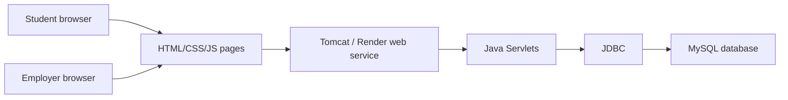

# Final Architecture

## Tech Stack

| Layer | Technology |
|---|---|
| Frontend | HTML, CSS, JavaScript |
| Backend | Java Servlets |
| Server | Apache Tomcat |
| Database | MySQL |
| Database access | JDBC / MySQL Connector |
| Hosting | Render with local Tomcat fallback |

## System Diagram

## Major Folders

| Folder | Purpose |
|---|---|
| `frontend/` | Login, register, job search, student profile, employer dashboard, post-job page, shared scripts and styles. |
| `Backend/` | Java Servlet source files and database connection helper. |
| `server/` | Local jar dependencies for MySQL and Servlet API. |
| `docs/` | Project docs, setup, architecture, testing, deployment, AI audit, sprint packets. |
| `demo-screenshots/` | Final product screenshots used for backup demo and portfolio. |
| `portfolio/` | Final handoff package for instructor review. |

## Major Components And Endpoints

| Component | Files | Purpose |
|---|---|---|
| Homepage | `index.html`, `frontend/style.css`, `frontend/script.js` | Product story and navigation. |
| Job search | `frontend/jobsearch.html`, `Backend/JobServlet.java` | Displays and loads job listings. |
| Register | `frontend/register.html`, `Backend/RegisterServlet.java` | Creates user accounts. |
| Login/logout | `frontend/login.html`, `Backend/LoginServlet.java`, `Backend/LogoutServlet.java` | Authenticates users and manages session state. |
| Student profile | `frontend/student-profile.html`, `Backend/StudentProfileServlet.java` | Shows student profile data. |
| Employer dashboard | `frontend/employer-dashboard.html`, `Backend/EmployerJobsServlet.java` | Shows employer-owned job posts. |
| Post job | `frontend/post-job.html`, `Backend/PostJobServlet.java` | Lets employers create job posts. |
| Database | `database_schema.sql`, `docs/database_jobs.sql` | Defines users, profiles, and jobs. |

## Data Model

| Table | Purpose |
|---|---|
| `users` | Stores basic user account data and account type. |
| `student_profiles` | Stores student education, preferences, address, and coordinates. |
| `employer_profiles` | Stores employer business information. |
| `jobs` | Stores job posts, company data, contact details, deadline, address, and coordinates. |

## External Services

| Service | Purpose |
|---|---|
| Render | Hosted demo target. |
| Hosted MySQL-compatible database | Production-like database for Render. |

## Architecture Risks

- Session-based role flows need careful testing in the deployed environment.
- Password storage is not production secure.
- The application flow is not fully implemented yet.
- Hosted database variables must be configured correctly.

